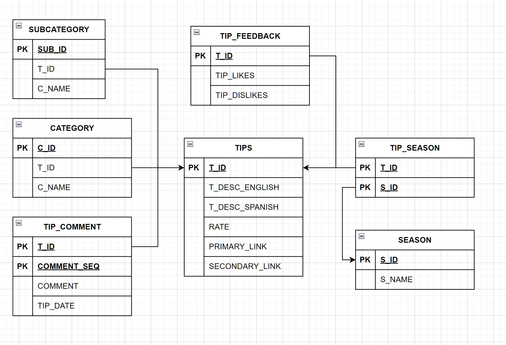
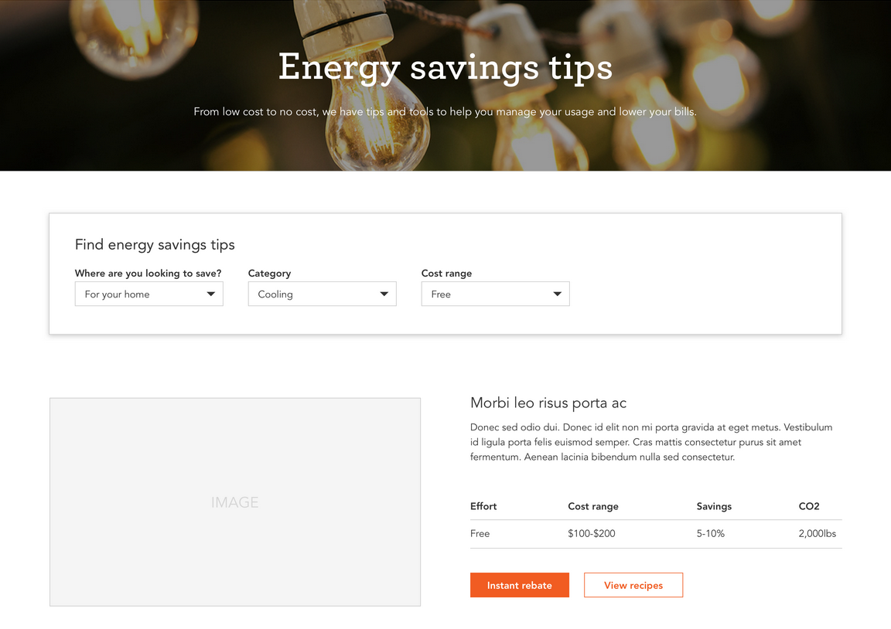
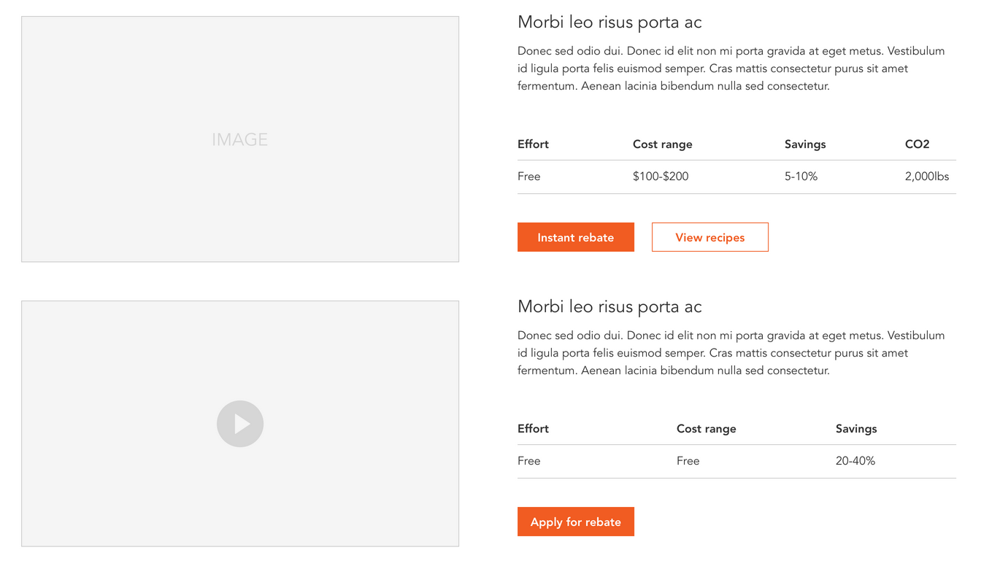

<p align="center">
    
</p>

<h3 align="center">Zero Carbon Engagement Tools</h3>

<p align="center">
    A tool to engage about 0 carbobs
</p>

# Table of Contents
* [Team](#team)
* [Synopsis](#synopsis)
* [Features](#features)
* [Tools and Techonologies](#tools-and-technologies)
* [Deployment](#deployment)
* [Testing](#testing)
* [Documentation](#documentation)
* [Milestones](#Milestones)
* [Database Diagram](#database-diagram)
* [Preview](#preview)


## Team
Programmadelic

### Team Members
* Mary Mendoza  
* Anne Liu  
* Anthony Muoa  
* Brian Giang  
* Dymone Hunt-Chambers  
* Edgar Moreno Gonzalez  
* Girard Lin  
* Leo Puso  
* Trevor Davis

### Advising Professors
* Haiquan (Victor) Chen
* Gary Kane

## Synopsis
In 2021, SMUD announced it’s 2030 Zero Carbon Plan to eliminate the use of greenhouse gas emissions and instead use clean energy. As part of this plan, SMUD would like to increase awareness and customer engagement. To increase customer engagement, the current energy savings tips page on the SMUD website will be redesigned to be more interactive. Customers reducing energy consumption will assist SMUD in reaching their zero-carbon goal as well as save customers money on their electricity bill. 

The energy savings tips webpage will allow for customers to view personalized tips based on filters such as potential savings, location, etc. Visitors of the webpage can also select tips to add to a personalized plan that can be converted to a downloadable PDF. In addition to designing the web pages and personalized user plan, if time and resources permit, the client has more ideas and tasks to impart to the development team in relation to the overarching theme of the task at hand, which is helping SMUD increase visibility and awareness of their 2030 Zero Carbon Plan.

## Features
* Pre-built pages
* Pre-styled components
* Custom PDF Generation
* Browse selection of curated tips
* Filtering options to find tips
* Search option to locate tips

## Tools and Technologies
* IDE
    * Microsoft Visual Studio Code (https://code.visualstudio.com/)
* Front-end
    * Bootstrap x.x.x
* Back-end
    * Microsoft SQL Server (https://www.microsoft.com/en-us/sql-server/sql-server-downloads)
* [SMUD's Style Guide](https://smud.invisionapp.com/console/share/GQFWV69JMDX/358962325/play)

## Deployment
### Requirements
* Git
* Node.js
* Windows:
    * Use `Set-ExecutionPolicy -Scope CurrentUser -ExecutionPolicy Unrestricted` to allow Windows to run scripts in system
    * Allow Node.js through Firewall

### Steps
1. Clone this repo: `git clone https://github.com/cyber-mary/zero-carbon-engagement-tools.git`
2. Navigate into local repo: `cd zero-carbon-engagement-tools`
3. Install `http-server` using `npm`: `npm install --global http-server`
4. Run `http-server` in local repo: `http-server`
5. Open http://localhost:8080 on a browser to view website
```
$ git clone https://github.com/cyber-mary/zero-carbon-engagement-tools.git
$ cd zero-carbon-engagement-tools
$ npm install --global http-server
$ http-server
```

## Milestones
* [Dropdown menu](/docs/dropdown.md)
* [User feedback](/docs/userfeedback.md)
* [User comment](/docs/usercomment.md)
* [Add tips to plan and download PDF](/docs/addtoplan.md)
* [Search bar](/docs/searchbar.md)
* [Dashboard](/docs/dashboard.md)

## Testing
* System Test Report

## Documentation
* Maintenence Manuel
* User Manuel

## Database Diagram



## Preview
<p align="center">
    When visiting  <a href="https://www.smud.org/en/Rebates-and-Savings-Tips/Energy-Savings-Tips">SMUD's Energy Savings Tips</a> webpage, this will be the future redesign.
</p>




<p align="center">
    Format and layout of what the tips will look like when results are shown.
</p>


