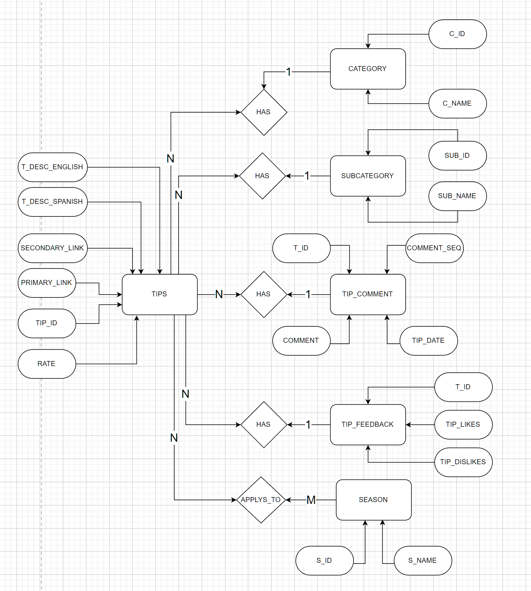
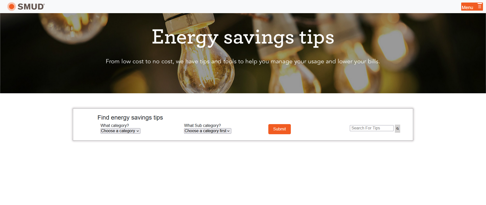
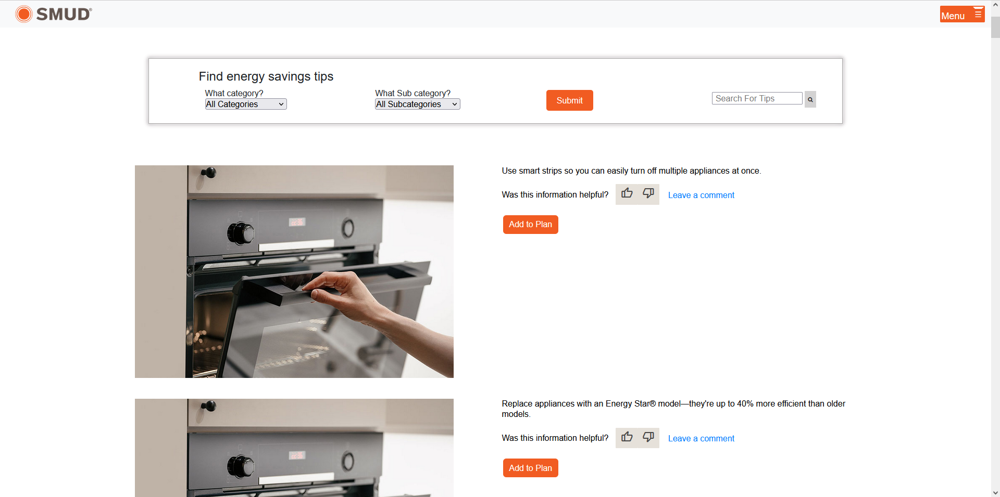

    

<h3 align="center">Zero Carbon Engagement Tools</h3>

    A tool to engage about 0 carbobs

# Table of Contents
* [Team](#team)
* [Synopsis](#synopsis)
* [Features](#features)
* [Tools and Techonologies](#tools-and-technologies)
* [Deployment](#deployment)
* [Testing](#testing)
* [Documentation](#documentation)
* [Milestones](#Milestones)
* [Database Diagram](#database-diagram)
* [Preview](#preview)

## Team
Programmadelic

### Team Members
* Mary Mendoza  
* Anne Liu  
* Anthony Muoa  
* Brian Giang  
* Dymone Hunt-Chambers  
* Edgar Moreno Gonzalez  
* Girard Lin  
* Leo Puso  
* Trevor Davis

### Advising Professors
* Haiquan (Victor) Chen
* Gary Kane

## Synopsis
In 2021, SMUD announced it’s 2030 Zero Carbon Plan to eliminate the use of greenhouse gas emissions and instead use clean energy. As part of this plan, SMUD would like to increase awareness and customer engagement. To increase customer engagement, the current energy savings tips page on the SMUD website will be redesigned to be more interactive. Customers reducing energy consumption will assist SMUD in reaching their zero-carbon goal as well as save customers money on their electricity bill. 

The energy savings tips webpage will allow for customers to view personalized tips based on filters such as potential savings, location, etc. Visitors of the webpage can also select tips to add to a personalized plan that can be converted to a downloadable PDF. In addition to designing the web pages and personalized user plan, if time and resources permit, the client has more ideas and tasks to impart to the development team in relation to the overarching theme of the task at hand, which is helping SMUD increase visibility and awareness of their 2030 Zero Carbon Plan.

## Features
* Pre-built pages
* Pre-styled components
* Custom PDF Generation
* Browse selection of curated tips
* Filtering options to find tips
* Search option to locate tips

## Tools and Technologies
* IDE
    * Microsoft Visual Studio Code (https://code.visualstudio.com/)
* Front-end
    * Bootstrap x.x.x
* Back-end
    * Microsoft SQL Server (https://www.microsoft.com/en-us/sql-server/sql-server-downloads)
* [SMUD's Style Guide](https://smud.invisionapp.com/console/share/GQFWV69JMDX/358962325/play)

## Deployment
### Prerequisites (Remote)
* An Azure Account
* An Azure Subscription
* Money

### Steps (Remote - PHP Hosting)
1. Fork the repository on GitHub by clicking the **Fork** button on the repository page.
2. Open the [Azure Portal](https://portal.azure.com/) and create a new Azure App Service.
3. In the **Instance Details** of the **Basics** tab, select **Code** for Publish and **PHP 8.0** for the **Runtime stack**. Configure any other necessary settings, like Resource Group and Instance Name.
4. In the **Deployment** tab, enable **Continouous deployment** and link your GitHub account and repository. The default workflow file should work or can be modified to look similar like [main_programmedelic.yml](https://github.com/cyber-mary/zero-carbon-engagement-tools/blob/main/.github/workflows/main_programmedelic.yml)
5. Review and make any necessary settings for other tabs, like **Networking**, **Monitoring**, and **Tags**
6. In the forked GitHub repo, check the **Actions** tab for status of building and deploying the website.

### Steps (Remote - Azure SQL)
1. Open the [Azure Portal](https://portal.azure.com/) and create a new Azure SQL server with a **Single database** as the Resource type.
2. In the **Basics** tab, create a Database name, **tips** (case-sensitive).
3. When creating a new server under the **Database details** section, make sure to match the SQL authentication with [config.php](https://github.com/cyber-mary/zero-carbon-engagement-tools/blob/main/config.php).
4. Review and make any necessary settings for other tabs, if needed.
5. Once the server is deployed, log in to the Azure SQL server using any tool that supports SQL Authentication (like [Microsoft SQL Server Developer Edition](https://www.microsoft.com/en-us/sql-server/sql-server-downloads) or [SQL Server (mssql) extension for VSCode](https://marketplace.visualstudio.com/items?itemName=ms-mssql.mssql))
6. Setup the database using query files [MicrosoftSQL_TipsDB.sql](https://github.com/cyber-mary/zero-carbon-engagement-tools/blob/main/sql/MicrosoftSQL_TipsDB.sql) & [MicrosoftSQL_TipsDB_queries.sql](https://github.com/cyber-mary/zero-carbon-engagement-tools/blob/main/sql/MicrosoftSQL_TipsDB_queries.sql)

### Prerequisites (Local)
* Docker Desktop
* Git

1. Clone the repository locally: `git clone https://github.com/cyber-mary/zero-carbon-engagement-tools.git`
2. `cd` into the cloned repo
3. Run the command `docker-compose up -d` to start the PHP and MSSQL server in the background.
4. Modify environment variables from mssql in the Dockerfile for SQL Authentication. (Change the name SA_PASSWORD to ???_PASSWORD, since username is *sa* by default)
5. Log in to the Microsoft SQL server using any tool that supports SQL Authentication, with the servername as *mssql*.
6. Setup the database using query files [MicrosoftSQL_TipsDB.sql](https://github.com/cyber-mary/zero-carbon-engagement-tools/blob/main/sql/MicrosoftSQL_TipsDB.sql) & [MicrosoftSQL_TipsDB_queries.sql](https://github.com/cyber-mary/zero-carbon-engagement-tools/blob/main/sql/MicrosoftSQL_TipsDB_queries.sql)
7. Open http://localhost:80 on a browser to view website

## Milestones
* [Dropdown menu](/docs/dropdown.md)
* [User feedback](/docs/userfeedback.md)
* [User comment](/docs/usercomment.md)
* [Add tips to plan and download PDF](/docs/addtoplan.md)
* [Search bar](/docs/searchbar.md)
* [Dashboard](/docs/dashboard.md)

## Testing
* System Test Report

## Documentation
* Maintenence Manual
* User Manual

## Database Diagram

## Preview

    When users visit SMUD's <a href="https://www.smud.org/en/Rebates-and-Savings-Tips/Energy-Savings-Tips">Energy Savings Tips</a> webpage, this will be the the updated landing page users see when they visit the website.

    The new landing page of the website offers users different ways to browse and select tips that meet their needs. Users can browse tips using a dropdown menu with two categories, allowing them to quickly and easily filter tips based on their interests.

