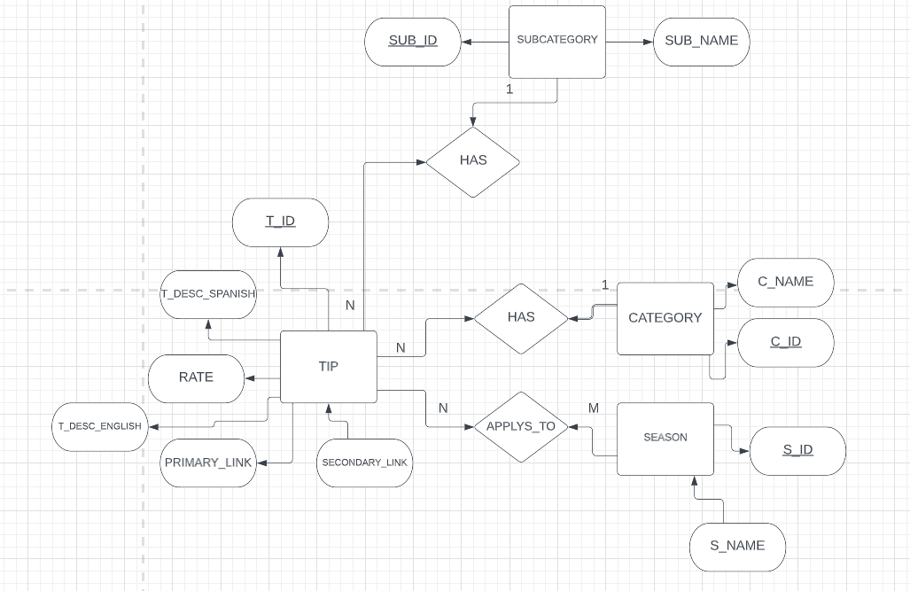
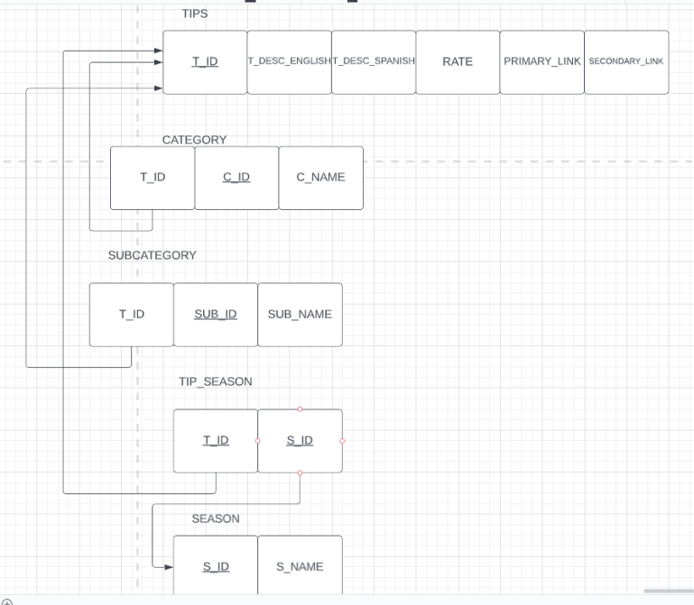
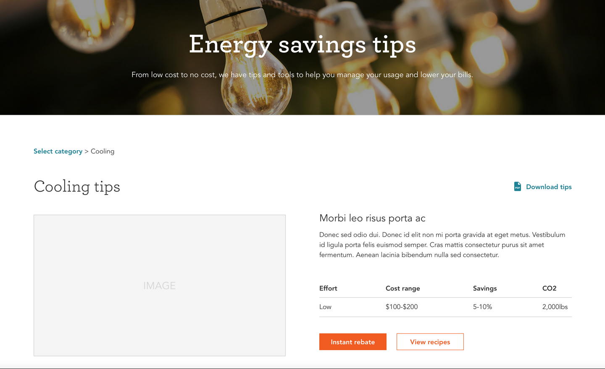

<p align="center">
    
</p>

<h3 align="center">Zero Carbon Engagement Tools</h3>

<p align="center">
    A tool to engage about 0 carbobs
</p>

# Table of Contents

* [Synopsis](#synopsis)
* [Features]($features)
* [Installation](#installation)
* [Deployment](#deployment)
* [Testing](#testing)
* [Timeline](#timeline)
* [Database Diagram](#database-diagram)
* [Preview](#preview)

## Synopsis

In 2021, SMUD announced it’s 2030 Zero Carbon Plan to eliminate the use of greenhouse gas emissions and instead use clean energy. As part of this plan, SMUD would like to increase awareness and customer engagement. To increase customer engagement, the current energy savings tips page on the SMUD website will be redesigned to be more interactive. Customers reducing energy consumption will assist SMUD in reaching their zero-carbon goal as well as save customers money on their electricity bill. 

The energy savings tips webpage will allow for customers to view personalized tips based on filters such as potential savings, location, etc. Visitors of the webpage can also select tips to add to a personalized plan that can be converted to a downloadable PDF. In addition to designing the web pages and personalized user plan, if time and resources permit, the client has more ideas and tasks to impart to the development team in relation to the overarching theme of the task at hand, which is helping SMUD increase visibility and awareness of their 2030 Zero Carbon Plan.

## Features
* Pre-built pages
* Pre-styled components
* Custom PDF Generation
* Energy saving tips selection
* Filtered tips
* IDE
    * Microsoft Visual Studio Code (https://code.visualstudio.com/)
* Front-end
    * Bootstrap x.x.x
* Back-end
    * Microsoft SQL Server (https://www.microsoft.com/en-us/sql-server/sql-server-downloads)
* [SMUD's Style Guide](https://smud.invisionapp.com/console/share/GQFWV69JMDX/358962325/play)


## Installation
```
git clone https://github.com/cyber-mary/zero-carbon-engagement-tools/
```
## Deployment

## Testing

## Timeline

## Database Diagram



## Preview

