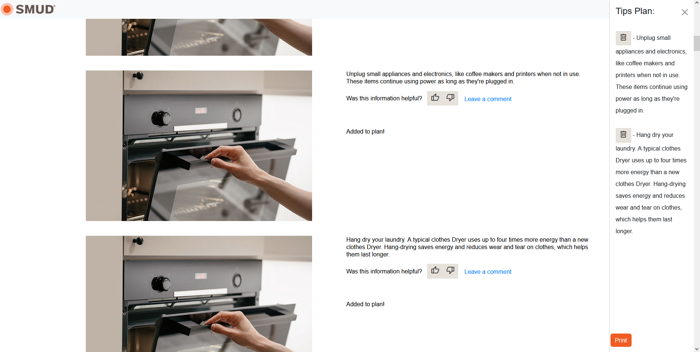
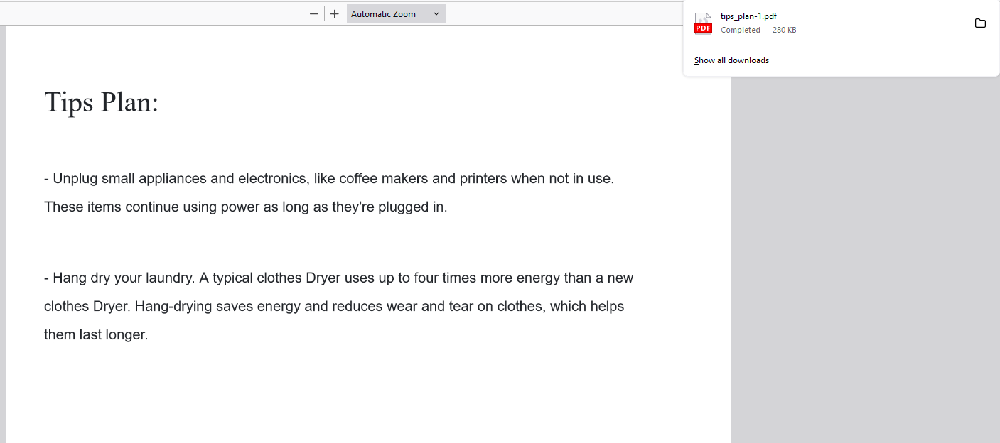

## Add to Plan
The webpage includes an "Add to Plan" button feature for every tip that allows users to add tips to a virtual shopping cart. Users can select multiple tips and add them to the cart, and can also remove tips from the cart as needed.

The cart provides a convenient way for users to keep track of their selected tips. Once users have selected all the tips they want to save, they can use the print button within the bottom of the cart to create a downloadable PDF file that includes all the tips they have saved.

