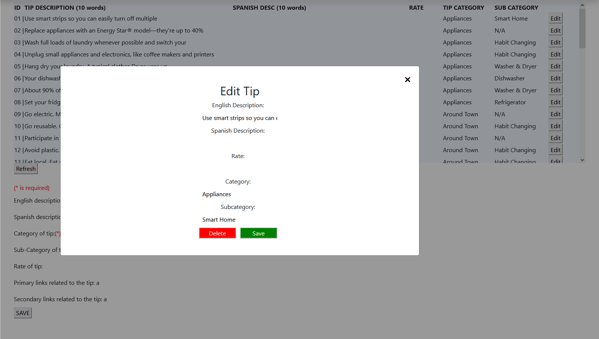

## Dashboard
The application's dashboard includes a telemetry tab that allows the owner to view information about the tips database without having to directly access the database itself. With the tips telemetry tab, the owner can quickly and easily view information about tips by their ID, description, category, and subcategory. In addition to basic tip information, the tips telemetry tab also provides detailed information about how users are interacting with the tips. This includes the number of likes and dislikes each tip has received, as well as the number of times the tip has been added to a user's plan.

In addition to the telemetry tab, the dashboard also includes a powerful modify tab that allows the owner of the application to easily modify tip information from a single location. With the modify tab, the owner can make changes to the tip database without having to directly access the database itself, making the process more efficient and user-friendly.

