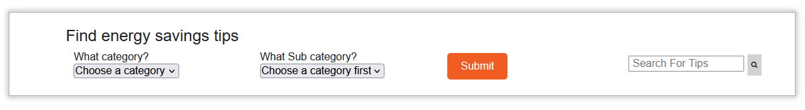
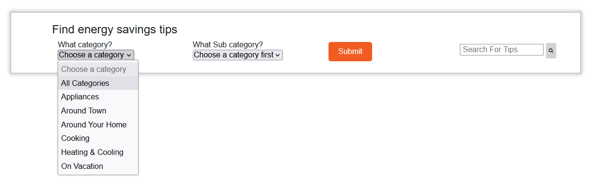
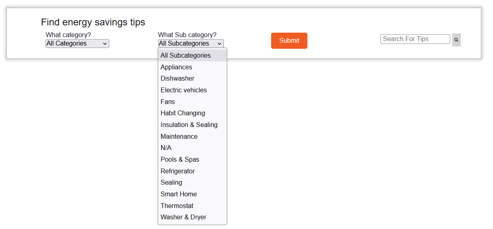
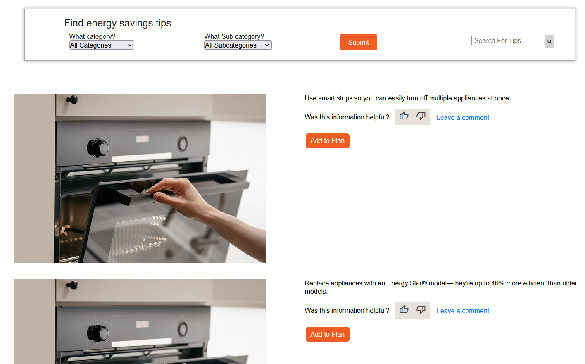

The dropdown menu allows users to filter tips based on two menu options. This feature provides a more streamlined user experience by reducing clutter on the webpage and enabling users to easily access the relevant information they need.

The dropdown menu feature consists of two menu options, each containing multiple categories and subcategories that the user can choose from. When a user selects one of the options, the dropdown menu dynamically updates to display the corresponding categories. The user can then select a category to view relevant tips related to that category.

When a user selects a category from the dropdown menu, the search results are dynamically populated from the application's database. The dynamic population of search results ensures that the user is presented with accurate and relevant information, reducing the likelihood of the user encountering outdated or irrelevant content. Additionally, the dynamic population of search results can save the user time by quickly providing them with the most up-to-date information, eliminating the need for the user to manually search for information across multiple web pages.

