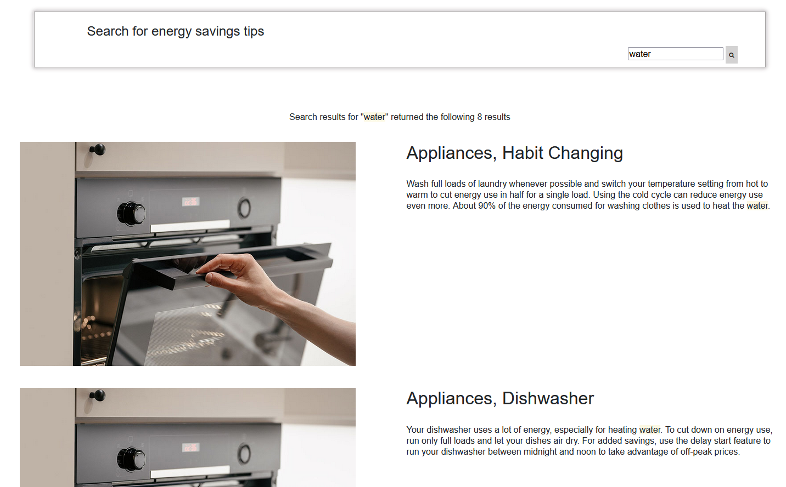

## Search bar
The search bar allows users to find tips by entering specific keywords. Instead of selecting from pre-defined categories, users can enter a keyword related to the topic they are interested in, and the application will query the database and return relevant results. The search feature provides a more flexible and precise way for users to find tips that meet their specific needs. Users can enter keywords related to their interests, rather than being limited to pre-defined categories. This means that the search results will be more specific and relevant to the user's needs, helping them to find the tips they need more efficiently.

