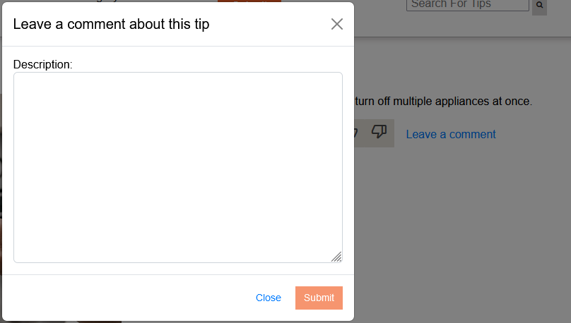
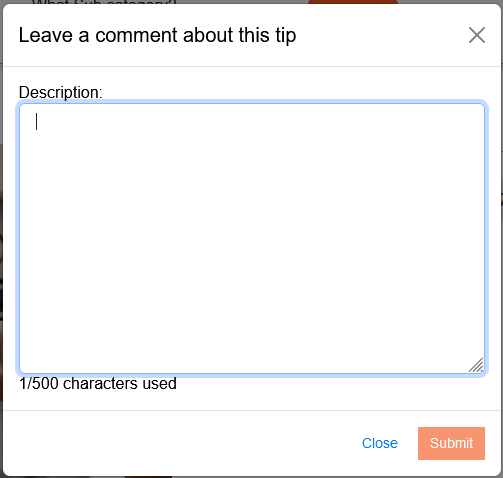

## User comments
The comment feature allows users to share their thoughts and opinions on tips. Users can leave comments on individual tips, providing feedback, suggestions, or additional information related to the tip. The comments can provide valuable feedback to SMUD, helping them to improve and refine the tips based on user input.

To ensure that comments are informative and useful, the comment box includes validation checks. The submit button is disabled if the comment box is empty, preventing users from submitting blank comments. Additionally, the comment box has a character limit of 500 characters, which helps users to focus their comments and ensure that they are concise and relevant.

