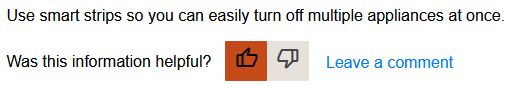

## User feedback
The webpage includes a feedback feature that allows users to rate tips using thumbs up and thumbs down buttons. When a user presses either button, the application increments a counter in the database that records the feedback. This data can then be used to determine the popularity of tips based on the number of thumbs up or thumbs down ratings they have received.

By using this feedback feature, users can quickly and easily provide feedback on items. Additionally, the data collected through the feedback feature can be used to improve the application by identifying popular and unpopular tips.

